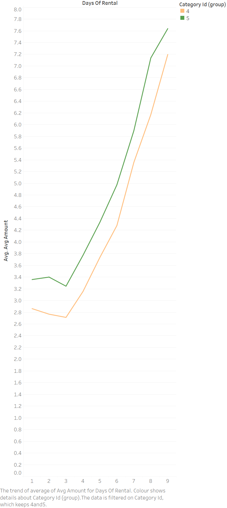

# FinancialStrategy_PricingStrategyForFilmRentals

## Objective

The goal is to analyse the rental data to find out the pricing strategy for film rentals.
For this goal, we first executed the below query, save the output to a .csv file.
Then, we used the .csv file to create a line chart to visualize the data.

## Visualization and Simple Analysis

The data was first aggregated by the category id and the number of days of rental.
Then, the average amount of rental rate was calculated for each category id and the number of days of rental.


After the visualization, it was observed that the rental rate is based on the number of days of rental.
The rental rate can be considered fixed for the first 3 days of rental. After that, the rental rate increases.

Also, the base rate is different for each film category. For example, the base rate for the "Comedy" category (category id: 5) is higher than the base rate for the "Classics" category (category id: 4).



It was also observed that the rental rate can be different for some films. That may be due to the popularity of the film. The detailed analysis is, however, out of scope for this project.

## Query

```sql
WITH cte_rule AS (SELECT f.film_id,
                         fc.category_id,
                         DATE_PART('day', r.return_date - r.rental_date) AS days_of_rental,
                         p.amount
                  FROM rental r
                           JOIN payment p ON r.rental_id = p.rental_id
                           JOIN inventory i ON r.inventory_id = i.inventory_id
                           JOIN film f ON i.film_id = f.film_id
                           JOIN film_category fc ON f.film_id = fc.film_id
                  WHERE DATE_PART('day', r.return_date - r.rental_date) > 0)
SELECT film_id, category_id, days_of_rental, AVG(amount) AS avg_amount
FROM cte_rule
GROUP BY film_id, category_id, days_of_rental
ORDER BY days_of_rental;
```

[Link to the .sql script file](./query.sql)

## Sample Output

It is to show the first 5 rows of the output.

| film\_id | category\_id | days\_of\_rental | avg\_amount |
| :--- | :--- | :--- | :--- |
| 1 | 6 | 1 | 0.99 |
| 2 | 11 | 1 | 4.99 |
| 3 | 6 | 1 | 2.99 |
| 4 | 11 | 1 | 2.99 |
| 5 | 8 | 1 | 2.99 |

[Link to the .csv output file](./output.csv)

