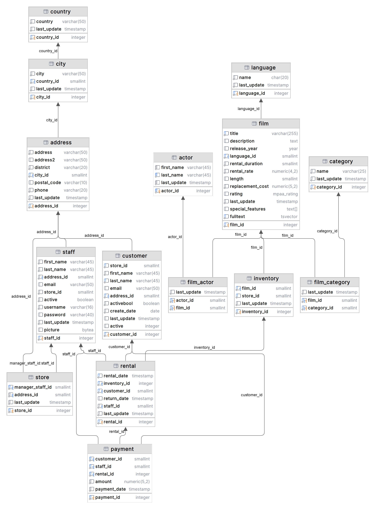

# PostgreSQL Project with DVD Rental Database

## Introduction

This project is part of Cantek's Data Analytics program. The goal is to create a PostgreSQL database for a DVD rental company. The database is created using the DVD Rental database, which is a sample database that represents the business processes of a DVD rental store. The .tar file of the database can be downloaded from [PostgreSQL Tutorial Website](http://www.postgresqltutorial.com/postgresql-sample-database/) or from [this repo](./dvdrental.tar).

## Database Schema

The database is composed of 15 tables:
- actor: stores actors data including first name and last name.
- address: stores address data for each staff member.
- category: stores movie’s categories data.
- city: stores city names.
- country: stores country names.
- customer: stores customers data.
- film: stores films data.
- film_actor: stores the relationships between films and actors.
- film_category: stores the relationships between films and categories.
- inventory: stores inventory data.
- language: stores languages data.
- payment: stores customer’s payments data.
- rental: stores rental data.
- staff: stores staff data.
- store: contains the store data. 

The following diagram illustrates the DVD Rental database tables and their relationships with each other.

## Database Queries

SQL queries are written and are used to answer the questions of the DVD rental company’s management.

### Understanding the Data
1. [How many films are there in each category?](./UnderstandingData_FilmsPerCategory)
2. [Which actors appear in the most films?](./UnderstandingData_ActorsInMostFilms)
3. [Which films are most popular, based on the number of rentals?](./UnderstandingData_MostPopularFilms)
4. [What is the average rental duration for each film category?](./UnderstandingData_AvgRentalDurationPerCategory)

### Financial Performance
1. [What is the monthly revenue, and how has it changed compared to the previous month?](./FinancialPerformance_MonthlyRevenueChange)
2. [How much revenue is generated by each film category?](./FinancialPerformance_RevenuePerFilmCategory)
3. **[Financial Strategy] [Can we tell the pricing strategy for film rentals based on the data?](./FinancialStrategy_PricingStrategyForFilmRentals)**

### Customer Behavior
1. [What is the monthly rental activity for each customer?](./CustomerBehavior_MonthlyRentalPerCustomer)
2. [How does revenue differ across various districts where our customers reside?](./CustomerBehavior_RevenuePerDistrict)
3. [How much did each customer spend on rentals in each month and how much is the difference compared with the average?](./CustomerBehavior_AvgMonthlySpendingPerCustomerVsOverall)

### Feature Engineering
1. [Can we add a description of the rating of each film?](./FeatureEngineering_RatingDescription)
2. [Can we predict customer churn based on their rental history?](./FeatureEngineering_PredictCustomerChurn)

